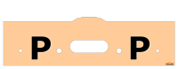
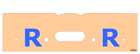
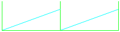
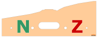

# Výkresy modulů modulovky TT KMŽ Brno I

Tento repozitář obsahuje výkresy modulů TT KMŽ Brno I. Dále obsahuje výkresy
užitečných nástrojů využitých při kreslení modulů.

Seznam všech modulů a přepravních čel je k dispozici
v [tabulce](https://docs.google.com/spreadsheets/d/18dqxd1UNPLrzmol-l9Jh0ruXuBpYiXmeyw5MG42Rct0/edit?usp=sharing).

## Čela

Ve výkresech používáme tyto značky pro čela:

 * Čelo PP:  
 * Čelo RR:  
 * Čelo NZ:  
 * Symbol `S` v kroužku: nestandardní čelo, je nutno připojit ke specifickému
   modulu (z kontextu by mělo být jasné ke kterému).

Viz [normu klubu Zabavov](http://144267.w67.wedos.ws/wp-content/uploads/2016/10/TTnorma.pdf).

Oranžové obrázky čel jsou převzaty z
[článku klubu Moduly Brno](http://www.modulybrno.cz/cela-modulu).
Děkujeme.