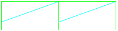

# Výkresy modulů modulovky TT KMŽ Brno I

Tento repozitář obsahuje výkresy modulů TT KMŽ Brno I. Dále obsahuje výkresy
užitečných nástrojů využitých při kreslení modulů.

Seznam všech modulů a přepravních čel je k dispozici
v [tabulce](https://docs.google.com/spreadsheets/d/18dqxd1UNPLrzmol-l9Jh0ruXuBpYiXmeyw5MG42Rct0/edit?usp=sharing).

## Čela

Ve výkresech používáme tyto značky pro čela:

 * Čelo PP: 
 * Čelo RR: 
 * Čelo ZN: 
   Levá část je čelo Z, pravá část je čelo N.
